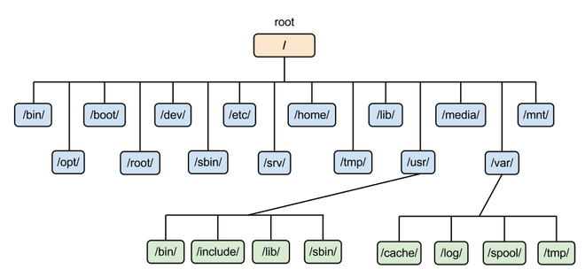

- 33.strace指令
- Linux命令你知道哪些？说说他们的作用
- 7 Linux的cpu 100怎么排查，top jstack，日志，gui工具
- 8 Linux大文件怎么查某一行的内容。
- 15 代码中遇到进程阻塞，进程僵死，内存泄漏等情况怎么排查。通过ps查询状态，分析dump文件等方式排查。
- 16 Linux了解么，查看进程状态ps，查看cpu状态 top。查看占用端口的进程号netstat grep

- gdb用过哪些指令，在其中怎么查看线程的运行情况
- linux 文件查找指令
- top显示出来的系统信息都是什么含义

- 7.查内存泄露用什么工具？自己使用过么
- 18.讲讲Linux内存管理
- 23.Linux下线程安全
- Linux下查看程序内存状况
答：top指令可以查看按内存大小排序的查询内存状况，或者查看/proc/pid/status文件，这个文件会记录进程id所代表的进程的内存状态

- linux下抓过指令
- linux下查看IO占用情况

用户态和内核态

cpu调优，io调优，内存调优

## Linux 查看内存
- cat /proc/meminfo


vim替换，删除，删除某一行，删除1到10行

linux熟悉吗，怎么杀死进程，怎么批量杀死进程，看进程号，
4.怎么看文件夹下有多少文件

linux操作：如何查找出现频率最高的100个ip地址
1.请问linux两台机器之间传文件，用的什么端口

2.请你说一说关于linux查看进程

3.请你说几个基本Linux命令

4.请你说一说Linux命令（查看进程、top命令、查看磁盘）

5请你说几个**inux指令

6.请你说一下vector的特性

7、查看端口号、进程的指令是？动态查看日志的指令？怎么判断一个端口存不存在，磁盘满了怎么处理，删除一个目录下的txt文件，你还熟悉其他什么linux指令？

8、请你说一下vi里面怎么替换字符串

9、请问contrab,uptime,du,netstat这几个指令有什么作用，如何查看磁盘分区状态

10、请问如何将文本中的T全部替换成t,将其中的一行复制新的一行出来

---

- [概念](#概念)
- [常用操作](#常用操作)
- [开发及调试](#开发及调试)
- [文件处理](#文件处理)
- [系统信息](#系统信息)
- [网络工具](#网络工具)
- [管道指令](#管道指令)

---

# 概念

## 文件权限

用户分为三种：文件拥有者、群组以及其它人，对不同的用户有不同的文件权限。

使用 ls 查看一个文件时，会显示一个文件的信息，例如 `drwxr-xr-x. 3 root root 17 May 6 00:14 .config`，对这个信息的解释如下：

- drwxr-xr-x：文件类型以及权限，第 1 位为文件类型字段，后 9 位为文件权限字段
- 3：链接数
- root：文件拥有者
- root：所属群组
- 17：文件大小
- May 6 00:14：文件最后被修改的时间
- .config：文件名

- 文件默认权限：文件默认没有可执行权限，因此为 666，也就是 -rw-rw-rw- 。
- 目录默认权限：目录必须要能够进入，也就是必须拥有可执行权限，因此为 777 ，也就是 drwxrwxrwx。

0～9位符号说明： 第0位：- 表示普通文件，d表示目录。 1～3位：表示文件所有者权限，r可读，w可写，x可执行，-表示无此权限；比如：r-x表示可读不可写可执行（3个字母顺序是固定的，哪个位置上是 - 就说明无此权限）。 4～6位：表示文件所在组成员权限，内容与1～3位一致。 7～9位：表示其他组成员权限，内容与1～3位一致。rwx分别为421

## 进程状态

| 状态 | 说明 |
| :---: | --- |
| R | running or runnable (on run queue) |
| D | uninterruptible sleep (usually I/O) |
| S | interruptible sleep (waiting for an event to complete) |
| Z | zombie (terminated but not reaped by its parent) |
| T | stopped (either by a job control signal or because it is being traced) |
<br>
<div align="center">  </div><br>

## SIGCHLD

当一个子进程改变了它的状态时（停止运行，继续运行或者退出），有两件事会发生在父进程中：

- 得到 SIGCHLD 信号；
- waitpid() 或者 wait() 调用会返回。

其中子进程发送的 SIGCHLD 信号包含了子进程的信息，比如进程 ID、进程状态、进程使用 CPU 的时间等。

在子进程退出时，它的进程描述符不会立即释放，这是为了让父进程得到子进程信息，父进程通过 wait() 和 waitpid() 来获得一个已经退出的子进程的信息。

## wait()

```c
pid_t wait(int *status)
```

父进程调用 wait() 会一直阻塞，直到收到一个子进程退出的 SIGCHLD 信号，之后 wait() 函数会销毁子进程并返回。

如果成功，返回被收集的子进程的进程 ID；如果调用进程没有子进程，调用就会失败，此时返回 -1，同时 errno 被置为 ECHILD。

参数 status 用来保存被收集的子进程退出时的一些状态，如果对这个子进程是如何死掉的毫不在意，只想把这个子进程消灭掉，可以设置这个参数为 NULL。

## waitpid()

```c
pid_t waitpid(pid_t pid, int *status, int options)
```

作用和 wait() 完全相同，但是多了两个可由用户控制的参数 pid 和 options。

pid 参数指示一个子进程的 ID，表示只关心这个子进程退出的 SIGCHLD 信号。如果 pid=-1 时，那么和 wait() 作用相同，都是关心所有子进程退出的 SIGCHLD 信号。

options 参数主要有 WNOHANG 和 WUNTRACED 两个选项，WNOHANG 可以使 waitpid() 调用变成非阻塞的，也就是说它会立即返回，父进程可以继续执行其它任务。

## 孤儿进程

一个父进程退出，而它的一个或多个子进程还在运行，那么这些子进程将成为孤儿进程。

孤儿进程将被 init 进程（进程号为 1）所收养，并由 init 进程对它们完成状态收集工作。

由于孤儿进程会被 init 进程收养，所以孤儿进程不会对系统造成危害。

## 僵尸进程

一个子进程的进程描述符在子进程退出时不会释放，只有当父进程通过 wait() 或 waitpid() 获取了子进程信息后才会释放。如果子进程退出，而父进程并没有调用 wait() 或 waitpid()，那么子进程的进程描述符仍然保存在系统中，这种进程称之为僵尸进程。

僵尸进程通过 ps 命令显示出来的状态为 Z（zombie）。

系统所能使用的进程号是有限的，如果产生大量僵尸进程，将因为没有可用的进程号而导致系统不能产生新的进程。

要消灭系统中大量的僵尸进程，只需要将其父进程杀死，此时僵尸进程就会变成孤儿进程，从而被 init 所收养，这样 init 就会释放所有的僵尸进程所占有的资源，从而结束僵尸进程。

## BIOS

BIOS（Basic Input/Output System，基本输入输出系统），它是一个固件（嵌入在硬件中的软件），BIOS 程序存放在断电后内容不会丢失的只读内存中。

BIOS 是开机的时候计算机执行的第一个程序，这个程序知道可以开机的磁盘，并读取磁盘第一个扇区的主要开机记录（MBR），由主要开机记录（MBR）执行其中的开机管理程序，这个开机管理程序会加载操作系统的核心文件。

主要开机记录（MBR）中的开机管理程序提供以下功能：选单、载入核心文件以及转交其它开机管理程序。转交这个功能可以用来实现了多重引导，只需要将另一个操作系统的开机管理程序安装在其它分区的启动扇区上，在启动开机管理程序时，就可以通过选单选择启动当前的操作系统或者转交给其它开机管理程序从而启动另一个操作系统。

下图中，第一扇区的主要开机记录（MBR）中的开机管理程序提供了两个选单：M1、M2，M1 指向了 Windows 操作系统，而 M2 指向其它分区的启动扇区，里面包含了另外一个开机管理程序，提供了一个指向 Linux 的选单。

安装多重引导，最好先安装 Windows 再安装 Linux。因为安装 Windows 时会覆盖掉主要开机记录（MBR），而 Linux 可以选择将开机管理程序安装在主要开机记录（MBR）或者其它分区的启动扇区，并且可以设置开机管理程序的选单。

## 文件系统组成

最主要的几个组成部分如下：

- inode：一个文件占用一个 inode，记录文件的属性，同时记录此文件的内容所在的 block 编号；
- block：记录文件的内容，文件太大时，会占用多个 block。

除此之外还包括：

- superblock：记录文件系统的整体信息，包括 inode 和 block 的总量、使用量、剩余量，以及文件系统的格式与相关信息等；
- block bitmap：记录 block 是否被使用的位域。

磁盘碎片

指一个文件内容所在的 block 过于分散。

建立一个目录时，会分配一个 inode 与至少一个 block。block 记录的内容是目录下所有文件的 inode 编号以及文件名。

## 文件系统block

在 Ext2 文件系统中所支持的 block 大小有 1K，2K 及 4K 三种，不同的大小限制了单个文件和文件系统的最大大小。

| 大小 | 1KB | 2KB | 4KB |
| :---: | :---: | :---: | :---: |
| 最大单一文件 | 16GB | 256GB | 2TB |
| 最大文件系统 | 2TB | 8TB | 16TB |

一个 block 只能被一个文件所使用，未使用的部分直接浪费了。因此如果需要存储大量的小文件，那么最好选用比较小的 block。

## 文件系统inode

inode 具体包含以下信息：

- 权限 (read/write/excute)；
- 拥有者与群组 (owner/group)；
- 容量；
- 建立或状态改变的时间 (ctime)；
- 最近一次的读取时间 (atime)；
- 最近修改的时间 (mtime)；
- 定义文件特性的旗标 (flag)，如 SetUID...；
- 该文件真正内容的指向 (pointer)。

inode 具有以下特点：

- 每个 inode 大小均固定为 128 bytes (新的 ext4 与 xfs 可设定到 256 bytes)；
- 每个文件都仅会占用一个 inode。

inode 中记录了文件内容所在的 block 编号，但是每个 block 非常小，一个大文件随便都需要几十万的 block。而一个 inode 大小有限，无法直接引用这么多 block 编号。因此引入了间接、双间接、三间接引用。间接引用是指，让 inode 记录的引用 block 块记录引用信息。

## 目录配置

为了使不同 Linux 发行版本的目录结构保持一致性，Filesystem Hierarchy Standard (FHS) 规定了 Linux 的目录结构。最基础的三个目录如下：

- / (root, 根目录)
- /usr (unix software resource)：所有系统默认软件都会安装到这个目录；
- /var (variable)：存放系统或程序运行过程中的数据文件。

<div align="center">  </div><br>

# 常用操作

## 求助

### 1. --help

指令的基本用法与选项介绍。

### 2. man

man 是 manual 的缩写，将指令的具体信息显示出来。

当执行`man date`时，有 DATE(1) 出现，其中的数字代表指令的类型，常用的数字及其类型如下：

| 代号 | 类型 |
| :--: | -- |
| 1 | 用户在 shell 环境中可以操作的指令或者可执行文件 |
| 5 | 配置文件 |
| 8 | 系统管理员可以使用的管理指令 |

### 3. info

info 与 man 类似，但是 info 将文档分成一个个页面，每个页面可以进行跳转。

### 4. doc

/usr/share/doc 存放着软件的一整套说明文件。

## 关机

### 1. who

在关机前需要先使用 who 命令查看有没有其它用户在线。

### 2. sync

为了加快对磁盘文件的读写速度，位于内存中的文件数据不会立即同步到磁盘上，因此关机之前需要先进行 sync 同步操作。

### 3. shutdown

```html
# shutdown [-krhc] 时间 [信息]
-k ： 不会关机，只是发送警告信息，通知所有在线的用户
-r ： 将系统的服务停掉后就重新启动
-h ： 将系统的服务停掉后就立即关机
-c ： 取消已经在进行的 shutdown 指令内容
```

# 开发及调试

## 调试工具：gdb

- 运行得不到正确结果可以通过gdb设置断点来查看每个中间变量值，以此来确定哪里出了问题。因为gdb调试内容较多，这里不详细说明。另外，gdb出了可以单步查看变量值，还可以分析coredump文件来排查错误。
    - 服务器端调试必备。
    - [详见](http://linuxtools-rst.readthedocs.io/zh_CN/latest/tool/gdb.html)
    
## 查看依赖库：ldd

- 命令：ldd ./server

- 可以查看可执行文件server所需的所有动态库，动态库所在目录及其被映射到的虚拟地址空间。
    - 程序依赖库查询
    ```shell
    # ldd后接可执行文件
    # 第一列为程序依赖什么库，第二列为系统提供的与程序需要的库所对应的库，第三列为库加载的开始地址
    # 前两列可以判断系统提供的库和需要的库是否匹配，第三列可以知道当前库在进程地址空间中对应的开始位置

    ldd a.out
    ```

## 二进制文件分析：objdump
    - 反汇编，需要理解汇编语言
    - [详见](http://man.linuxde.net/objdump)

## ELF文件格式分析：readelf
    - 可以得到ELF文件各段内容，分析链接、符号表等需要用到
    - [详见](http://linuxtools-rst.readthedocs.io/zh_CN/latest/tool/readelf.html)

## 跟踪进程中系统调用：strace
    - [详见](http://linuxtools-rst.readthedocs.io/zh_CN/latest/tool/strace.html)

- 命令：strace ./server

- 上面已经提到TKeed server的CPU占用率为99%，那么问题通常一定是出在了死循环上。我们接下来在代码中找到死循环位置。因为程序中epoll_wait需要阻塞进程，我们怀疑是不是这里没有阻塞，这时就可以通过上面的方式运行server程序。此时可以打印出没次系统调用及其参数等，我们也可以加-o filename将系统调用信息保存下来。

## 跟踪进程栈：pstack
    - [详见](http://linuxtools-rst.readthedocs.io/zh_CN/latest/tool/pstack.html#)

## 进程内存映射：pmap
    - 显示进程内存映射
    ```shell
    # -x显示扩展信息，后接进程pid
    # Address: 内存开始地址
    # 显示信息：
        Kbytes: 占用内存的字节数
        RSS: 保留内存的字节数
        Dirty: 脏页的字节数（包括共享和私有的）
        Mode: 内存的权限：read、write、execute、shared、private
        Mapping: 占用内存的文件、或[anon]（分配的内存）、或[stack]（堆栈）
        Device: 设备名 (major:minor)

    pmap -x 12345
    ```


# 文件处理

## VIM

- 一般指令模式（Command mode）：VIM 的默认模式，可以用于移动游标查看内容；
- 编辑模式（Insert mode）：按下 "i" 等按键之后进入，可以对文本进行编辑；
- 指令列模式（Bottom-line mode）：按下 ":" 按键之后进入，用于保存退出等操作。

在指令列模式下，有以下命令用于离开或者保存文件。

| 命令 | 作用 |
| :--: | :--: |
| :w | 写入磁盘|
| :w! | 当文件为只读时，强制写入磁盘。到底能不能写入，与用户对该文件的权限有关 |
| :q | 离开 |
| :q! | 强制离开不保存 |
| :wq | 写入磁盘后离开 |
| :wq!| 强制写入磁盘后离开 |


## sudo

sudo 允许一般用户使用 root 可执行的命令，不过只有在 /etc/sudoers 配置文件中添加的用户才能使用该指令。

## 1. ls

列出文件或者目录的信息，目录的信息就是其中包含的文件。

```html
# ls [-aAdfFhilnrRSt] file|dir
-a ：列出全部的文件
-d ：仅列出目录本身
-l ：以长数据串行列出，包含文件的属性与权限等等数据
```

## 2. cd

更换当前目录。

```
cd [相对路径或绝对路径]
```

## 3. mkdir

创建目录。

```
# mkdir [-mp] 目录名称
-m ：配置目录权限
-p ：递归创建目录
```

## 4. rmdir

删除目录，目录必须为空。

```html
rmdir [-p] 目录名称
-p ：递归删除目录
```

## 5. touch

更新文件时间或者建立新文件。

```html
# touch [-acdmt] filename
-a ： 更新 atime
-c ： 更新 ctime，若该文件不存在则不建立新文件
-m ： 更新 mtime
-d ： 后面可以接更新日期而不使用当前日期，也可以使用 --date="日期或时间"
-t ： 后面可以接更新时间而不使用当前时间，格式为[YYYYMMDDhhmm]
```

## 6. cp

复制文件。

如果源文件有两个以上，则目的文件一定要是目录才行。

```html
cp [-adfilprsu] source destination
-a ：相当于 -dr --preserve=all 的意思，至于 dr 请参考下列说明
-d ：若来源文件为链接文件，则复制链接文件属性而非文件本身
-i ：若目标文件已经存在时，在覆盖前会先询问
-p ：连同文件的属性一起复制过去
-r ：递归持续复制
-u ：destination 比 source 旧才更新 destination，或 destination 不存在的情况下才复制
--preserve=all ：除了 -p 的权限相关参数外，还加入 SELinux 的属性, links, xattr 等也复制了
```

## 7. rm

删除文件。

```html
# rm [-fir] 文件或目录
-r ：递归删除
```

## 8. mv

移动文件。

```html
# mv [-fiu] source destination
# mv [options] source1 source2 source3 .... directory
-f ： force 强制的意思，如果目标文件已经存在，不会询问而直接覆盖
```

## 压缩指令

### 1. gzip

gzip 是 Linux 使用最广的压缩指令，可以解开 compress、zip 与 gzip 所压缩的文件。

经过 gzip 压缩过，源文件就不存在了。

有 9 个不同的压缩等级可以使用。

可以使用 zcat、zmore、zless 来读取压缩文件的内容。

```html
$ gzip [-cdtv#] filename
-c ：将压缩的数据输出到屏幕上
-d ：解压缩
-t ：检验压缩文件是否出错
-v ：显示压缩比等信息
-# ： # 为数字的意思，代表压缩等级，数字越大压缩比越高，默认为 6
```

### 2. bzip2

提供比 gzip 更高的压缩比。

查看命令：bzcat、bzmore、bzless、bzgrep。

```html
$ bzip2 [-cdkzv#] filename
-k ：保留源文件
```

### 3. xz

提供比 bzip2 更佳的压缩比。

可以看到，gzip、bzip2、xz 的压缩比不断优化。不过要注意的是，压缩比越高，压缩的时间也越长。

查看命令：xzcat、xzmore、xzless、xzgrep。

```html
$ xz [-dtlkc#] filename
```

## 打包

压缩指令只能对一个文件进行压缩，而打包能够将多个文件打包成一个大文件。tar 不仅可以用于打包，也可以使用 gip、bzip2、xz 将打包文件进行压缩。

```html
$ tar [-z|-j|-J] [cv] [-f 新建的 tar 文件] filename...  ==打包压缩
$ tar [-z|-j|-J] [tv] [-f 已有的 tar 文件]              ==查看
$ tar [-z|-j|-J] [xv] [-f 已有的 tar 文件] [-C 目录]    ==解压缩
-z ：使用 zip；
-j ：使用 bzip2；
-J ：使用 xz；
-c ：新建打包文件；
-t ：查看打包文件里面有哪些文件；
-x ：解打包或解压缩的功能；
-v ：在压缩/解压缩的过程中，显示正在处理的文件名；
-f : filename：要处理的文件；
-C 目录 ： 在特定目录解压缩。
```

| 使用方式 | 命令 |
| :---: | --- |
| 打包压缩 | tar -jcv -f filename.tar.bz2 要被压缩的文件或目录名称 |
| 查 看 | tar -jtv -f filename.tar.bz2 |
| 解压缩 | tar -jxv -f filename.tar.bz2 -C 要解压缩的目录 |

## 文件查找：find

### 按名查找：

    - 查找具体文件（一般方式）
    ```shell
    find . -name *.cpp
    ```

    - 查找具体文件（正则方式）
    ```shell
    # -regex为正则查找，-iregex为忽略大小写的正则查找 

    find -regex ".*.cpp$"
    ```

### 按类型查找
    ```shell
    # f(file)为文件，d(dictionary)为目录，l(link)为链接

    find . -type f
    ```

### 按时间查找
    ```shell
    # atime为访问时间，x天内加参数"-atime -x"，超过x天加"-atime -x"
    # mtime为修改时间

    find . -type f -atime -7
    ```
```html
-mtime  n ：列出在 n 天前的那一天修改过内容的文件
-mtime +n ：列出在 n 天之前 (不含 n 天本身) 修改过内容的文件
-mtime -n ：列出在 n 天之内 (含 n 天本身) 修改过内容的文件
-newer file ： 列出比 file 更新的文件
```

### 按大小查找
    ```shell
    # -size后接文件大小，单位可以为k(kb)，m(MB)，g(GB)

    find . -type f -size -1k
    ```

### 按权限查询
```shell
    # -perm后接权限
    
    find . -type -perm 644
```

```html
-name filename
-size [+-]SIZE：搜寻比 SIZE 还要大 (+) 或小 (-) 的文件。这个 SIZE 的规格有：c: 代表 byte，k: 代表 1024bytes。所以，要找比 50KB 还要大的文件，就是 -size +50k
-type TYPE
-perm mode  ：搜索权限等于 mode 的文件
-perm -mode ：搜索权限包含 mode 的文件
-perm /mode ：搜索权限包含任一 mode 的文件
```

### 按文件拥有者和所属群组

```html
-uid n
-gid n
-user name
-group name
-nouser ：搜索拥有者不存在 /etc/passwd 的文件
-nogroup：搜索所属群组不存在于 /etc/group 的文件
```

## 文本搜索：grep

- g/re/p（globally search a regular expression and print)，使用正则表示式进行全局查找并打印。

```html
$ grep [-acinv] [--color=auto] 搜寻字符串 filename
-c ： 统计个数
-i ： 忽略大小写
-n ： 输出行号
-v ： 反向选择，也就是显示出没有 搜寻字符串 内容的那一行
--color=auto ：找到的关键字加颜色显示
```

- 匹配test.cpp文件中含有"iostream"和"using"串的内容

```shell
grep -e "using" -e "iostream" test.cpp  
```

- 把含有 the 字符串的行提取出来（注意默认会有 --color=auto 选项，因此以下内容在 Linux 中有颜色显示 the 字符串）

```html
$ grep -n 'the' regular_express.txt
8:I can't finish the test.
12:the symbol '*' is represented as start.
15:You are the best is mean you are the no. 1.
16:The world Happy is the same with "glad".
18:google is the best tools for search keyword
```

因为 { 和 } 在 shell 是有特殊意义的，因此必须要使用转义字符进行转义。

```html
$ grep -n 'go\{2,5\}g' regular_express.txt
```

## 格式化输出printf

它不属于管道命令，在给 printf 传数据时需要使用 $( ) 形式。

```html
$ printf '%10s %5i %5i %5i %8.2f \n' $(cat printf.txt)
    DmTsai    80    60    92    77.33
     VBird    75    55    80    70.00
       Ken    60    90    70    73.33
```

## 3. 排序：sort
    - 文件内容行排序
    ```shell
    # 排序在内存进行，不改变文件
    # -n(number)表示按数字排序，-d(dictionary)表示按字典序
    # -k N表示按各行第N列进行排序
    # -r(reverse)为逆序排序

    sort -n -k 1 test
    ```

## 4. 转换：tr
    - 字符替换
    ```shell
    # 转换在内存进行，不改变文件
    # 将打开文件中所有目标字符替换

    cat test | tr '1' '2'
    ```

    - 字符删除
    ```shell
    # 转换在内存进行，不改变文件
    # -d删除(delete)

    cat test | tr -d '1'
    ```

    - 字符压缩
    ```shell
    # 转换在内存进行，不改变文件
    # -s位于后部

    cat test | tr ' ' -s
    ```
## 5. 按列切分文本：cut
    - 截取特定列
    ```shell
    # 截取的内存进行，不改变文件
    # -b(byte)以字节为单位，-c(character)以字符为单位，-f以字段为单位
    # 数字为具体列范围

    cut -f 1,2 test
    ```

    - 指定界定符
    ```shell
    # 截取的内存进行，不改变文件
    # -d后接界定符

    cut -f 2 -d ',' new
    ```

## 6. 按列拼接文本：paste
    - 按列拼接
    ```shell
    # 在内存中拼接，不改变文件
    # 将两个文件按对应列拼接
    # 最后加上-d "x"会将x作为指定分隔符（paste test1 test2 -d ","）
    # 两文件列数可以不同 

    paste test1 test2
    ```
    - 指定界定符拼接
    ```shell
    # 在内存中拼接，不改变文件
    # 按照-d之后给出的界定符拼接

    paste test1 test2 -d ","
    ```

## 7. 统计行和字符：wc
     - 基本统计
     ```shell
     # -l统计行数(line)，-w统计单词数(word)，-c统计字符数(character)

     wc -l test
     ```
## 8. 文本替换：sed
    - 区别于上面的命令，sed是可以直接改变被编辑文件内容的。
    - [详见](http://coolshell.cn/articles/9104.html)

## 数据流处理：awk

- awk 每次处理一行，处理的最小单位是字段，每个字段的命名方式为：\$n，n 为字段号，从 1 开始，\$0 表示一整行。
- 示例：/etc/passwd 文件第三个字段为 UID，对 UID 小于 10 的数据进行处理。

```text
$ cat /etc/passwd | awk 'BEGIN {FS=":"} $3 < 10 {print $1 "\t " $3}'
root 0
bin 1
daemon 2
```

## 修改文件权限：chmod

- chmod 000 ./index.html

- 可以修改文件权限，这里设为000，这样任何人都无法访问，重新在浏览器请求127.0.0.1:3000/index.html就会因为文件权限不够而无法展示，服务器返回状态码为403，符合我们预期。修改权限后再请求一次可得到状态码200。

可以将一组权限用数字来表示，此时一组权限的 3 个位当做二进制数字的位，从左到右每个位的权值为 4、2、1，即每个权限对应的数字权值为 r : 4、w : 2、x : 1。
三种权限，r(read)，w(write)，x(execute)
示例：将 .bashrc 文件的权限修改为 -rwxr-xr--。

```html
# chmod 754 .bashrc
```

## 创建链接：ln

### 硬（实体链接）链接

有以下限制：不能跨越文件系统、不能对目录进行链接。

```shell
    # 文件inode中链接数会增加，只有链接数减为0时文件才真正被删除

    ln file1 file2
```

### 软（符号链接）链接

当源文件被删除了，链接文件就打不开了。

可以为目录建立链接。

    ```shell
    # -s(symbol)为符号链接，仅仅是引用路径
    # 相比于硬链接最大特点是可以跨文件系统
    # 类似于Windows创建快捷方式，实际文件删除则链接失效

    ln -s file1 file2
    ```
## 获取文件内容

### 1. cat

取得文件内容。

```html
# cat [-AbEnTv] filename
-n ：打印出行号，连同空白行也会有行号，-b 不会
```

### 2. tac

是 cat 的反向操作，从最后一行开始打印。

### 3. more

和 cat 不同的是它可以一页一页查看文件内容，比较适合大文件的查看。

### 4. less

和 more 类似，但是多了一个向前翻页的功能。

### 5. head

取得文件前几行。

```html
# head [-n number] filename
-n ：后面接数字，代表显示几行的意思
```

### 6. tail

是 head 的反向操作，只是取得是后几行。
    - 查看文件尾部
    ```shell
    # -f参数可以不立即回传结束信号，当文件有新写入数据时会及时更新
    # 查看日志时常用

    tail -f test
    ```

### 7. od

以字符或者十六进制的形式显示二进制文件。

## 6. 设置别名：alias
    - 常用命令添加别名
    ```shell
    # ".bashrc"文件中配置常用命令别名，生效后在命令行只需要使用别名即可代替原先很长的命令

    alias rm='rm -i'
    ```

# 系统信息

## 1. 进程查询：ps

查看某个时间点的进程信息

示例一：查看自己的进程

```sh
# ps -l
```

示例二：查看系统所有进程

```sh
# ps aux
```

示例三：查看特定的进程

```sh
# ps aux | grep threadx
```
    - 查看正在运行进程
    ```shell
    # 常结合grep筛选信息(e.g, ps -ef | grep xxx)

    ps -ef
    ```

    - 以完整格式显示所有进程
    ```shell
    # 常结合grep筛选信息

    ps -ajx
    ```
- 命令：ps -ejH

- 我们在命令行下打开的程序的父进程是shell程序，之前用strace打开server程序，strace也是server的父进程。我们有时候需要知道进程间的层级关系就需要打印进程树，上面的ps命令可以做到。当出现僵尸进程时就可以通过进程树定位具体是哪个进程出了问题。另外当想要知道进程pid时，ps -el | grep XXX也是很常用的。

## 2. pstree

查看进程树

示例：查看所有进程树

```sh
# pstree -A
```

## 2. 进程监控：top

实时显示进程信息

示例：两秒钟刷新一次

```sh
# top -d 2
```

- top可以查看当前系统很多信息，比如1,5,15分钟内负载，运行、休眠、僵尸进程数，用户、内核程序占CPU百分比，存储信息等。top可以定位具体哪个进程CPU占用率高和内存使用率高。我们可以以此定位性能问题出在什么程序上（比如你后台执行TKeed server之后，可以看到CPU占用率为99%，这时候我们就需要从这个程序入手了）。
    - 显示实时进程信息
    ```shell
    # 这是个大招，都不带参数的，具体信息通过grep筛选
    # 交互模式下键入M进程列表按内存使用大小降序排列，键入P进程列表按CPU使用大小降序排列
    # %id表示CPU空闲率，过低表示可能存在CPU存在瓶颈
    # %wa表示等待I/O的CPU时间百分比，过高则I/O存在瓶颈 > 用iostat进一步分析

    top
    ```

## 3. 打开文件查询：lsof

- lsof -i:3000

- 比如在运行server时发现端口被占用了，可以通过lsof -i:port来查看对应端口号正在被哪个进程所占用。端口占用是非常常见的问题，比如3306被占用我遇到过好几次，要么是某个程序正好占用了要么是之前没能结束进程，这些都可以借助lsof帮助查看端口。
   - 查看占用某端口的进程
    ```shell
    # 最常见的就是mysql端口被占用使用(lsof i:3307)
    # 周知端口(ftp:20/21, ssh:22, telnet:23, smtp:25, dns:53, http:80, pop3:110, https:443)

    lsof -i:53
    ```

    - 查看某用户打开的文件 
    ```shell
    # -u(user)为用户，后接用户名

    lsof -u inx
    ```

    - 查看指定进程打开的文件 
    ```shell
    # -p(process)为进程，后接进程PID

    lsof -p 12345
    ```

    - 查看指定目录下被进程打开的文件 
    ```shell
    # 这里是"+d"，需要注意，使用"+D"递归目录

    lsof +d /test
    ```

## 4. 内存使用量：free
    - 内存使用量
    ```shell
    # 可获得内存及交换区的总量，已使用量，空闲量等信息

    free
    ```

## 5. 监控性能指标：sar

    监控CPU
    - 监控CPU负载
    ```shell
    # 加上-q可以查看运行队列中进程数，系统上进程大小，平均负载等
    # 这里"1"表示采样时间间隔是1秒，这里"2"表示采样次数为2

    sar -q 1 2
    ```

    - 监控CPU使用率
    ```shell
    # 可以显示CPU使用情况
    # 参数意义同上

    sar -u 1 2
    ```

    监控内存
    - 查询内存
    ```shell
    # 可以显示内存使用情况
    # 参数意义同上 

    sar -r 1 2
    ```

    - 页面交换查询
     ```shell
     # 可以查看是否发生大量页面交换，吞吐率大幅下降时可用
     # 参数意义同上

    sar -W 1 2
    ```

## 1. 终止进程：kill
    - 杀死具体进程
    ```shell
    # 加具体进程PID

    kill 12345
    ```

    - 杀死某进程相关进程
    ```shell 
    # 加上"-9"杀死某进程相关进程

    kill -9 12345
    ```

# 网络工具

## 1. 网卡配置（链路层）：ifconfig 

- ifconfig

- 如果想看一下整个传输过程，可以使用tcpdump来抓包，但是抓包时参数需要加上网卡信息，这时候可以通过ifconfig来获得网卡信息。
    - 显示设备信息
    ```shell
    # 可以显示已激活的网络设备信息

    ifconfig
    ```
    - 启动关闭指定网卡
    ```shell
    # 前一个参数为具体网卡，后一个为开关信息
    # up为打开，down为关闭

    ifconfig eth0 up
    ```

    - 配置IP地址
    ```shell
    # 前一个参数为具体网卡，后一个为配置的IP地址

    ifconfig eth0 192.168.1.1
    ```

    - 设置最大传输单元
    ```shell
    前一个参数为具体网卡，后面为MTU的大小
    # 设置链路层MTU值，通常为1500

    ifconfig eth0 mtu 1500
    ```

    - 启用和关闭ARP协议
    ```
    # 开启arp如下，若关闭则-arp

    ifconfig eth0 arp
    ```

## 2. 查看当前网络连接（链路层/网络层/传输层）：netstat

查看占用端口的进程

示例：查看特定端口的进程

```sh
# netstat -anp | grep port
```
    - 网络接口信息
    ```shell
    # 显示网卡信息，可结合ifconfig学习

    netstat -i
    ```

    - 列出端口
    ```shell
    # -a(all)表示所有端口，-t(tcp)表示所有使用中的TCP端口
    # -l(listening)表示正在监听的端口
    
    netstat -at
    ```

    - 显示端口统计信息
    ```shell
    # -s(status)显示各协议信息
    # -加上-t(tcp)显示tcp协议信息，加上-u(udp)显示udp协议信息

    netstat -s
    ```

    - 显示使用某协议的应用名
    ```shell 
    # -p(progress)表示程序，可以显示使用tcp/udp协议的应用的名称

    netstat -pt
    ```

    - 查找指定进程、端口
    ```shell
    # 互逆操作第一个显示某程序使用的端口号，第二个显示某端口号的使用进程
    # 第二个操作可以用lsof替代

    netstat -ap | grep ssh
    netstat -an | grep ':80'
    ```

## 3. 查看路由表（网络层IP协议）：route
    - 查看路由信息
    ```shell
    # 得到路由表信息，具体分析路由表工作需要网络知识
    # 可以通过netstat -r(route)得到同样的路由表

    route
    ```

## 4. 检查网络连通性（网络层ICMP协议）：ping
    - 检查是否连通
    ```shell
    # 主要功能是检测网络连通性
    # 可以额外得到网站的ip地址和连接最大/最小/平均耗时。

    ping baidu.com
    ```

## 5. 转发路径（网络层ICMP协议）：traceroute
    - 文件包途径的IP
    ```shell
    # 
    # 可以打印从沿途经过的路由器IP地址

    traceroute baidu.com
    ``` 

## 6. 网络Debug分析（网络层/传输层）：nc
    - 端口扫描
    ```shell
    # 黑客很喜欢
    # 扫描某服务器端口使用情况
    # -v(view)显示指令执行过程，-w(wait)设置超时时长
    # -z使用输入输出模式（只在端口扫描时使用）
    # 数字为扫描的端口范围 

    nc -v -w 1 baidu.com  -z 75-1000
    ```

    - [其他详见](https://www.oschina.net/translate/linux-netcat-command)

## 7. 命令行抓包（网络层/传输层）：tcpdump
    - 抓包利器，没有什么比数据更值得信赖。可以跟踪整个传输过程。
    - [详见](http://www.cnblogs.com/ggjucheng/archive/2012/01/14/2322659.html)

- tcpdump -i eth0 port 3000

- 可以用tcpdump来抓包分析三次握手及数据传输过程，-i之后加上上一步得到的网卡地址，port可以指定监听的端口号。


## 8. 域名解析工具（应用层DNS协议）：dig
    ```shell
    # 应用层，DNS
    # 打印域名解析结果
    # 打印域名解析过程中涉及的各级DNS服务器地址

    dig baidu.com
    ```

## 9. 网络请求（应用层）：curl

# 管道指令

管道是将一个命令的标准输出作为另一个命令的标准输入，在数据需要经过多个步骤的处理之后才能得到我们想要的内容时就可以使用管道。

在命令之间使用 | 分隔各个管道命令。

```bash
$ ls -al /etc | less
```

## 提取指令

cut 对数据进行切分，取出想要的部分。

切分过程一行一行地进行。

```html
$ cut
-d ：分隔符
-f ：经过 -d 分隔后，使用 -f n 取出第 n 个区间
-c ：以字符为单位取出区间
```

示例 1：last 显示登入者的信息，取出用户名。

```html
$ last
root pts/1 192.168.201.101 Sat Feb 7 12:35 still logged in
root pts/1 192.168.201.101 Fri Feb 6 12:13 - 18:46 (06:33)
root pts/1 192.168.201.254 Thu Feb 5 22:37 - 23:53 (01:16)

$ last | cut -d ' ' -f 1
```

示例 2：将 export 输出的信息，取出第 12 字符以后的所有字符串。

```html
$ export
declare -x HISTCONTROL="ignoredups"
declare -x HISTSIZE="1000"
declare -x HOME="/home/dmtsai"
declare -x HOSTNAME="study.centos.vbird"
.....(其他省略).....

$ export | cut -c 12-
```

## 排序指令

**sort**  用于排序。

```html
$ sort [-fbMnrtuk] [file or stdin]
-f ：忽略大小写
-b ：忽略最前面的空格
-M ：以月份的名字来排序，例如 JAN，DEC
-n ：使用数字
-r ：反向排序
-u ：相当于 unique，重复的内容只出现一次
-t ：分隔符，默认为 tab
-k ：指定排序的区间
```

示例：/etc/passwd 文件内容以 : 来分隔，要求以第三列进行排序。

```html
$ cat /etc/passwd | sort -t ':' -k 3
root:x:0:0:root:/root:/bin/bash
dmtsai:x:1000:1000:dmtsai:/home/dmtsai:/bin/bash
alex:x:1001:1002::/home/alex:/bin/bash
arod:x:1002:1003::/home/arod:/bin/bash
```

**uniq**  可以将重复的数据只取一个。

```html
$ uniq [-ic]
-i ：忽略大小写
-c ：进行计数
```

示例：取得每个人的登录总次数

```html
$ last | cut -d ' ' -f 1 | sort | uniq -c
1
6 (unknown
47 dmtsai
4 reboot
7 root
1 wtmp
```

## 双向输出重定向

输出重定向会将输出内容重定向到文件中，而  **tee**  不仅能够完成这个功能，还能保留屏幕上的输出。也就是说，使用 tee 指令，一个输出会同时传送到文件和屏幕上。

```html
$ tee [-a] file
```

## 字符转换指令

**tr**  用来删除一行中的字符，或者对字符进行替换。

```html
$ tr [-ds] SET1 ...
-d ： 删除行中 SET1 这个字符串
```

示例，将 last 输出的信息所有小写转换为大写。

```html
$ last | tr '[a-z]' '[A-Z]'
```

  **col**  将 tab 字符转为空格字符。

```html
$ col [-xb]
-x ： 将 tab 键转换成对等的空格键
```

**expand**  将 tab 转换一定数量的空格，默认是 8 个。

```html
$ expand [-t] file
-t ：tab 转为空格的数量
```

**join**  将有相同数据的那一行合并在一起。

```html
$ join [-ti12] file1 file2
-t ：分隔符，默认为空格
-i ：忽略大小写的差异
-1 ：第一个文件所用的比较字段
-2 ：第二个文件所用的比较字段
```

**paste**  直接将两行粘贴在一起。

```html
$ paste [-d] file1 file2
-d ：分隔符，默认为 tab
```

## 分区指令

**split**  将一个文件划分成多个文件。

```html
$ split [-bl] file PREFIX
-b ：以大小来进行分区，可加单位，例如 b, k, m 等
-l ：以行数来进行分区。
- PREFIX ：分区文件的前导名称
```