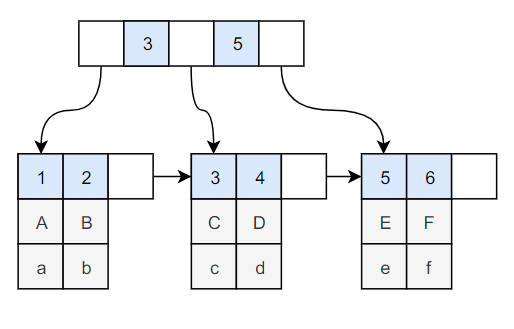
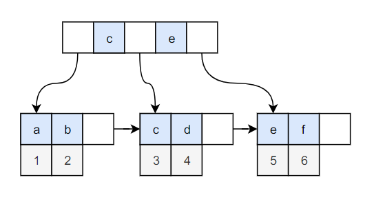
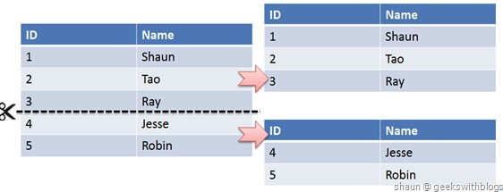
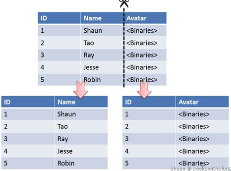

https://zhuanlan.zhihu.com/p/60348440?utm_source=wechat_session&utm_medium=social&utm_oi=642159079888392192

# MySQL

## MySQL 索引

- 索引是在存储引擎层实现的，而不是在服务器层实现的，所以不同存储引擎具有不同的索引类型和实现。
- 将字段通过一定的方法进行存储，好让查询该字段上的信息时，能够快速找到对应的数据，
- MySQL中的索引的存储类型有两种：BTREE、HASH
- 所有的MySql列类型(字段类型)都可以被索引，也就是可以给任意字段设置索引

## 索引的类型

- 普通索引：仅加速查询
- 唯一索引：加速查询 + 列值唯一（可以有null）
- 主键索引：加速查询 + 列值唯一（不可以有null）+ 表中只有一个
- 组合索引（联合索引）（复合索引）：多列值组成一个索引，专门用于组合搜索，其效率大于索引合并
- 全文索引：对文本的内容进行分词，进行搜索

## 复合索引

- 复合索引的建立需要进行仔细分析；尽量考虑用单字段索引代替
- A、正确选择复合索引中的主列字段，一般是选择性较好的字段；
- B、复合索引的几个字段是否经常同时以AND方式出现在Where子句中？单字段查询是否极少甚至没有？如果是，则可以建立复合索引；否则考虑单字段索引；
- C、如果复合索引中包含的字段经常单独出现在Where子句中，则分解为多个单字段索引；
- D、如果复合索引所包含的字段超过3个，那么仔细考虑其必要性，考虑减少复合的字段；
- E、如果既有单字段索引，又有这几个字段上的复合索引，一般可以删除复合索引；

## @B+树与红黑树索引的比较

红黑树等平衡树也可以用来实现索引，但是文件系统及数据库系统普遍采用 B+ Tree 作为索引结构，主要有以下两个原因：

（一）更少的查找次数

平衡树查找操作的时间复杂度和树高 h 相关，O(h)=O(log<sub>d</sub>N)，其中 d 为每个节点的出度。

红黑树的出度为 2，而 B+ Tree 的出度一般都非常大，所以红黑树的树高 h 很明显比 B+ Tree 大非常多，查找的次数也就更多。

（二）利用磁盘预读特性

为了减少磁盘 I/O 操作，磁盘往往不是严格按需读取，而是每次都会预读。预读过程中，磁盘进行顺序读取，顺序读取不需要进行磁盘寻道，并且只需要很短的旋转时间，速度会非常快。

操作系统一般将内存和磁盘分割成固定大小的块，每一块称为一页，内存与磁盘以页为单位交换数据。数据库系统将索引的一个节点的大小设置为页的大小，使得一次 I/O 就能完全载入一个节点。并且可以利用预读特性，相邻的节点也能够被预先载入。

## @B+树和完全平衡二叉树

## B+Tree 索引

是大多数 MySQL 存储引擎的默认索引类型。

因为不再需要进行全表扫描，只需要对树进行搜索即可，所以查找速度快很多。

除了用于查找，还可以用于排序和分组。

可以指定多个列作为索引列，多个索引列共同组成键。

适用于全键值、键值范围和键前缀查找，其中键前缀查找只适用于最左前缀查找。如果不是按照索引列的顺序进行查找，则无法使用索引。

InnoDB 的 B+Tree 索引分为主索引和辅助索引。主索引的叶子节点 data 域记录着完整的数据记录，这种索引方式被称为聚簇索引。因为无法把数据行存放在两个不同的地方，所以一个表只能有一个聚簇索引。

<div align="center">  </div><br>

辅助索引的叶子节点的 data 域记录着主键的值，因此在使用辅助索引进行查找时，需要先查找到主键值，然后再到主索引中进行查找。

<div align="center">  </div><br>

## MYSQL索引为什么用B+树

- 能够定位到数据点和范围查询。修改key与子树的组织逻辑，将索引访问都落到叶子节点并 按顺序将叶子节点串起来（方便范围查询）
- 1、 B+树的磁盘读写代价更低：B+树的内部节点并没有指向关键字具体信息的指针，因此其内部节点相对B树更小，如果把所有同一内部节点的关键字存放在同一盘块中，那么盘块所能容纳的关键字数量也越多，一次性读入内存的需要查找的关键字也就越多，相对IO读写次数就降低了。

- 2、B+树的查询效率更加稳定：由于非终结点并不是最终指向文件内容的结点，而只是叶子结点中关键字的索引。所以任何关键字的查找必须走一条从根结点到叶子结点的路。所有关键字查询的路径长度相同，导致每一个数据的查询效率相当。

- 3、由于B+树的数据都存储在叶子结点中，分支结点均为索引，方便扫库，只需要扫一遍叶子结点即可，但是B树因为其分支结点同样存储着数据，我们要找到具体的数据，需要进行一次中序遍历按序来扫，所以B+树更加适合在区间查询的情况，所以通常B+树用于数据库索引。
- B树在提高了IO性能的同时并没有解决元素遍历的我效率低下的问题，正是为了解决这个问题，B+树应用而生。B+树只需要去遍历叶子节点就可以实现整棵树的遍历。而且在数据库中基于范围的查询是非常频繁的，而B树不支持这样的操作或者说效率太低。

## 哈希索引

哈希索引能以 O(1) 时间进行查找，但是失去了有序性：

- 无法用于排序与分组；
- 只支持精确查找，无法用于部分查找和范围查找。

InnoDB 存储引擎有一个特殊的功能叫“自适应哈希索引”，当某个索引值被使用的非常频繁时，会在 B+Tree 索引之上再创建一个哈希索引，这样就让 B+Tree 索引具有哈希索引的一些优点，比如快速的哈希查找。

- A：哈希索引只包含哈希值和行指针，而不存储字段值，所以不能使用索引中的值来避免读取行（即不能使用哈希索引来做覆盖索引扫描），不过，访问内存中的行的速度很快（因为memory引擎的数据都保存在内存里），所以大部分情况下这一点对性能的影响并不明显。
- B：哈希索引数据并不是按照索引列的值顺序存储的，所以也就无法用于排序
- C：哈希索引也不支持部分索引列匹配查找，因为哈希索引始终是使用索引的全部列值内容来计算哈希值的。如：数据列（a,b）上建立哈希索引，如果只查询数据列a，则无法使用该索引。
- D：哈希索引只支持等值比较查询，如：=,in(),<=>(注意，<>和<=>是不同的操作)，不支持任何范围查询（必须给定具体的where条件值来计算hash值，所以不支持范围查询）。
- E：访问哈希索引的数据非常快，除非有很多哈希冲突，当出现哈希冲突的时候，存储引擎必须遍历链表中所有的行指针，逐行进行比较，直到找到所有符合条件的行。
- F：如果哈希冲突很多的话，一些索引维护操作的代价也很高，如：如果在某个选择性很低的列上建立哈希索引（即很多重复值的列），那么当从表中删除一行时，存储引擎需要遍历对应哈希值的链表中的每一行，找到并删除对应的引用，冲突越多，代价越大。

## 全文索引

MyISAM 存储引擎支持全文索引，用于查找文本中的关键词，而不是直接比较是否相等。

查找条件使用 MATCH AGAINST，而不是普通的 WHERE。

全文索引使用倒排索引实现，它记录着关键词到其所在文档的映射。

InnoDB 存储引擎在 MySQL 5.6.4 版本中也开始支持全文索引。

## 空间数据索引

MyISAM 存储引擎支持空间数据索引（R-Tree），可以用于地理数据存储。空间数据索引会从所有维度来索引数据，可以有效地使用任意维度来进行组合查询。

必须使用 GIS 相关的函数来维护数据。

## 索引优化

### 1. 独立的列

在进行查询时，索引列不能是表达式的一部分，也不能是函数的参数，否则无法使用索引。

例如下面的查询不能使用 actor_id 列的索引：

```sql
SELECT actor_id FROM sakila.actor WHERE actor_id + 1 = 5;
```

### 2. 多列索引

在需要使用多个列作为条件进行查询时，使用多列索引比使用多个单列索引性能更好。例如下面的语句中，最好把 actor_id 和 film_id 设置为多列索引。

```sql
SELECT film_id, actor_ id FROM sakila.film_actor
WHERE actor_id = 1 AND film_id = 1;
```

### 3. 索引列的顺序

让选择性最强的索引列放在前面。

索引的选择性是指：不重复的索引值和记录总数的比值。最大值为 1，此时每个记录都有唯一的索引与其对应。选择性越高，查询效率也越高。

例如下面显示的结果中 customer_id 的选择性比 staff_id 更高，因此最好把 customer_id 列放在多列索引的前面。

```sql
SELECT COUNT(DISTINCT staff_id)/COUNT(*) AS staff_id_selectivity,
COUNT(DISTINCT customer_id)/COUNT(*) AS customer_id_selectivity,
COUNT(*)
FROM payment;
```

```html
   staff_id_selectivity: 0.0001
customer_id_selectivity: 0.0373
               COUNT(*): 16049
```

### 4. 前缀索引

对于 BLOB、TEXT 和 VARCHAR 类型的列，必须使用前缀索引，只索引开始的部分字符。

对于前缀长度的选取需要根据索引选择性来确定。

### 5. 覆盖索引

索引包含所有需要查询的字段的值。

具有以下优点：

- 索引通常远小于数据行的大小，只读取索引能大大减少数据访问量。
- 一些存储引擎（例如 MyISAM）在内存中只缓存索引，而数据依赖于操作系统来缓存。因此，只访问索引可以不使用系统调用（通常比较费时）。
- 对于 InnoDB 引擎，若辅助索引能够覆盖查询，则无需访问主索引。

## 索引的优点

- 大大减少了服务器需要扫描的数据行数。
- 大大加快数据的查询速度
- 帮助服务器避免进行排序和分组，以及避免创建临时表（B+Tree 索引是有序的，可以用于 ORDER BY 和 GROUP BY 操作。临时表主要是在排序和分组过程中创建，因为不需要排序和分组，也就不需要创建临时表）。
- 将随机 I/O 变为顺序 I/O（B+Tree 索引是有序的，会将相邻的数据都存储在一起）。

## 索引的缺点

- 1、创建索引和维护索引要耗费时间，并且随着数据量的增加所耗费的时间也会增加
- 2、索引也需要占空间，我们知道数据表中的数据也会有最大上线设置的，如果我们有大量的索引，索引文件可能会比数据文件更快达到上线值
- 3、当对表中的数据进行增加、删除、修改时，索引也需要动态的维护，降低了数据的维护速度。

## 索引的使用条件

- 对于非常小的表、大部分情况下简单的全表扫描比建立索引更高效；
- 对于中到大型的表，索引就非常有效；
- 但是对于特大型的表，建立和维护索引的代价将会随之增长。这种情况下，需要用到一种技术可以直接区分出需要查询的一组数据，而不是一条记录一条记录地匹配，例如可以使用分区技术。
- 1、对经常更新的表就避免对其进行过多的索引，对经常用于查询的字段应该创建索引，
- 2、数据量小的表最好不要使用索引，因为由于数据较少，可能查询全部数据花费的时间比遍历索引的时间还要短，索引就可能不会产生优化效果。
- 3、在一同值少的列上(字段上)不要建立索引，比如在学生表的"性别"字段上只有男，女两个不同值。相反的，在一个字段上不同值较多可是建立索引

## @查询性能优化

### 使用 Explain 进行分析

Explain 用来分析 SELECT 查询语句，开发人员可以通过分析 Explain 结果来优化查询语句。

比较重要的字段有：

- select_type : 查询类型，有简单查询、联合查询、子查询等
- key : 使用的索引
- rows : 扫描的行数

### 优化数据访问

#### 1. 减少请求的数据量

- 只返回必要的列：最好不要使用 SELECT * 语句。
- 只返回必要的行：使用 LIMIT 语句来限制返回的数据。
- 缓存重复查询的数据：使用缓存可以避免在数据库中进行查询，特别在要查询的数据经常被重复查询时，缓存带来的查询性能提升将会是非常明显的。

#### 2. 减少服务器端扫描的行数

最有效的方式是使用索引来覆盖查询。

### 重构查询方式

#### 1. 切分大查询

一个大查询如果一次性执行的话，可能一次锁住很多数据、占满整个事务日志、耗尽系统资源、阻塞很多小的但重要的查询。

#### 2. 分解大连接查询

将一个大连接查询分解成对每一个表进行一次单表查询，然后在应用程序中进行关联，这样做的好处有：

- 让缓存更高效。对于连接查询，如果其中一个表发生变化，那么整个查询缓存就无法使用。而分解后的多个查询，即使其中一个表发生变化，对其它表的查询缓存依然可以使用。
- 分解成多个单表查询，这些单表查询的缓存结果更可能被其它查询使用到，从而减少冗余记录的查询。
- 减少锁竞争；
- 在应用层进行连接，可以更容易对数据库进行拆分，从而更容易做到高性能和可伸缩。
- 查询本身效率也可能会有所提升。例如下面的例子中，使用 IN() 代替连接查询，可以让 MySQL 按照 ID 顺序进行查询，这可能比随机的连接要更高效。

## @MySQL的存储引擎

- InnoDB：默认的事务型存储引擎，支持事务处理，支持外键，支持崩溃修复能力和并发控制。如果需要对事务的完整性要求比较高（比如银行），要求实现并发控制（比如售票），那选择InnoDB有很大的优势。如果需要频繁的更新、删除操作的数据库，也可以选择InnoDB，因为支持事务的提交（commit）和回滚（rollback）。
- InnoDB是 MySQL 默认的事务型存储引擎，只有在需要它不支持的特性时，才考虑使用其它存储引擎。
- 实现了四个标准的隔离级别，默认级别是可重复读（REPEATABLE READ）。在可重复读隔离级别下，通过多版本并发控制（MVCC）+ 间隙锁（Next-Key Locking）防止幻影读。
- 主索引是聚簇索引，在索引中保存了数据，从而避免直接读取磁盘，因此对查询性能有很大的提升。
- 内部做了很多优化，包括从磁盘读取数据时采用的可预测性读、能够加快读操作并且自动创建的自适应哈希索引、能够加速插入操作的插入缓冲区等。
- 支持真正的在线热备份。其它存储引擎不支持在线热备份，要获取一致性视图需要停止对所有表的写入，而在读写混合场景中，停止写入可能也意味着停止读取。

---

- MyISAM：插入数据快，空间和内存使用比较低。如果表主要是用于插入新记录和读出记录，那么选择MyISAM能实现处理高效率。如果应用的完整性、并发性要求比 较低，也可以使用。
- 设计简单，数据以紧密格式存储。对于只读数据，或者表比较小、可以容忍修复操作，则依然可以使用它。
- 提供了大量的特性，包括压缩表、空间数据索引等。
- 不支持事务。
- 不支持行级锁，只能对整张表加锁，读取时会对需要读到的所有表加共享锁，写入时则对表加排它锁。但在表有读取操作的同时，也可以往表中插入新的记录，这被称为并发插入（CONCURRENT INSERT）。
- 可以手工或者自动执行检查和修复操作，但是和事务恢复以及崩溃恢复不同，可能导致一些数据丢失，而且修复操作是非常慢的。

---

- MEMORY：所有的数据都在内存中，数据的处理速度快，但是安全性不高。如果需要很快的读写速度，对数据的安全性要求较低，可以选择MEMOEY。它对表的大小有要求，不能建立太大的表。所以，这类数据库只使用在相对较小的数据库表。

## @MySQL两个常用的存储引擎比较

- 事务：InnoDB 是事务型的，可以使用 Commit 和 Rollback 语句。
- 并发：MyISAM 只支持表级锁，而 InnoDB 还支持行级锁。
- 外键：InnoDB 支持外键。
- 备份：InnoDB 支持在线热备份。
- 崩溃恢复：MyISAM 崩溃后发生损坏的概率比 InnoDB 高很多，而且恢复的速度也更慢。
- 其它特性：MyISAM 支持压缩表和空间数据索引。

## @MySQL数据类型

- 整型：TINYINT, SMALLINT, MEDIUMINT, INT, BIGINT 分别使用 8, 16, 24, 32, 64 位存储空间，一般情况下越小的列越好。
- 浮点数：FLOAT 和 DOUBLE 为浮点类型，DECIMAL 为高精度小数类型。CPU 原生支持浮点运算，但是不支持 DECIMAl 类型的计算，因此 DECIMAL 的计算比浮点类型需要更高的代价。
- 字符串：主要有 CHAR 和 VARCHAR 两种类型，一种是定长的，一种是变长的。
- 日期 DATETIME：能够保存从 1001 年到 9999 年的日期和时间，精度为秒，使用 8 字节的存储空间。与时区无关。
- 时间 TIMESTAMP：和 UNIX 时间戳相同，保存从 1970 年 1 月 1 日午夜（格林威治时间）以来的秒数，使用 4 个字节，只能表示从 1970 年到 2038 年。和时区有关，也就是说一个时间戳在不同的时区所代表的具体时间是不同的。
- 应该尽量使用 TIMESTAMP，因为它比 DATETIME 空间效率更高。

## 水平切分 Sharding

- 将同一个表中的记录拆分到多个结构相同的表中。

- 当一个表的数据不断增多时，Sharding 是必然的选择，它可以将数据分布到集群的不同节点上，从而缓存单个数据库的压力。

<div align="center">  </div><br>

Sharding 策略

- 哈希取模：hash(key) % N；
- 范围：可以是 ID 范围也可以是时间范围；
- 映射表：使用单独的一个数据库来存储映射关系。

ID 唯一性

- 使用全局唯一 ID（GUID）
- 为每个分片指定一个 ID 范围
- 分布式 ID 生成器 (如 Twitter 的 Snowflake 算法)

## 垂直切分

垂直切分是将一张表按列切分成多个表，通常是按照列的关系密集程度进行切分，也可以利用垂直切分将经常被使用的列和不经常被使用的列切分到不同的表中。

在数据库的层面使用垂直切分将按数据库中表的密集程度部署到不同的库中，例如将原来的电商数据库垂直切分成商品数据库、用户数据库等。

<div align="center">  </div><br>

## 主从复制

主要涉及三个线程：binlog 线程、I/O 线程和 SQL 线程。

-  **binlog 线程** ：负责将主服务器上的数据更改写入二进制日志（Binary log）中。
-  **I/O 线程** ：负责从主服务器上读取二进制日志，并写入从服务器的重放日志（Replay log）中。
-  **SQL 线程** ：负责读取重放日志并重放其中的 SQL 语句。

## 读写分离

主服务器处理写操作以及实时性要求比较高的读操作，而从服务器处理读操作。

读写分离能提高性能的原因在于：

- 主从服务器负责各自的读和写，极大程度缓解了锁的争用；
- 从服务器可以使用 MyISAM，提升查询性能以及节约系统开销；
- 增加冗余，提高可用性。

读写分离常用代理方式来实现，代理服务器接收应用层传来的读写请求，然后决定转发到哪个服务器。

## Query Cache

- 为了加快查询语句的执行性能
- 完全独立工作于各种数据库引擎的上层，并使用独立的内存区域。
- 当某一个客户端连接（session）进行SQL查询并得到返回信息时，MySQL数据库除了将查询结果返回给客户端外，还在特定的内存区域缓存这条SQL查询语句的结果，以便包括这个客户端在内的所有客户的再次执行相同查询请求时，MySQL能够直接从缓存区返回结果。

避免“缓存数据不一致”的问题？

- 一旦被缓存的查询结果所涉及的数据表发生了“写”操作，那么无论“写”操作本身是否影响到被缓存的数据，涉及到数据表的所有缓存数据都将被清除。
- 这种简单暴力的处理方式，不仅绕过了数据一致性问题，还节约了宝贵的时间——因为在大多数数据库应用中，读请求是远远多余写请求的。
- MySQL数据库读写请求比例达到或查过1：1，那么使用Query Cache就没有什么意义，建议直接关闭。

## 主键和唯一索引的区别

1.主键为一种约束，唯一索引为一种索引，本质上就不同；

2.主键创建后一定包含唯一性索引，而唯一索引不一定就是主键；

3.主键不允许空值，唯一索引可以为空；

4.主键可以被其他表引用，而唯一索引不可以；

5.一个表最多只能创建一个主键，而可以创建多个唯一索引；

6.主键和索引都是键，主键是逻辑键，索引为物理键，即主键不实际存在。

## 约束

- 1.主键约束（PRIMARY KEY）

1) 主键用于唯一地标识表中的每一条记录，可以定义一列或多列为主键。
2) 是不可能（或很难）更新．
3) 主键列上没有任何两行具有相同值（即重复值），不允许空（NULL）．
4) 主健可作外健，唯一索引不可；

- 2.唯一性约束（UNIQUE）

1) 唯一性约束用来限制不受主键约束的列上的数据的唯一性，用于作为访问某行的可选手段，一个表上可以放置多个唯一性约束．
2) 只要唯一就可以更新．
3) 即表中任意两行在  指定列上都不允许有相同的值，允许空（NULL）．
4) 一个表上可以放置多个唯一性约束

- 3.唯一索引（INDEX）

创建唯一索引可以确保任何生成重复键值的尝试都会失败。

## 约束和索引区别

前者是用来检查数据的正确性，后者用来实现数据查询的优化，目的不同。

## 唯一性约束与唯一索引

（1）.唯一性约束允许在该列上存在NULL值，而主键约束的限制更为严格，不但不允许有重复，而且也不允许有空值。
（2）.在创建唯一性约束和主键约束时可以创建聚集索引和非聚集索引，但在 默认情况下主键约束产生聚集索引，而唯一性约束产生非聚集索引

   （1）.创建唯一约束会在Oracle中创建一个Constraint，同时也会创建一个该约束对应的唯一索引。

   （2）.创建唯一索引只会创建一个唯一索引，不会创建Constraint。

   也就是说其实唯一约束是通过创建唯一索引来实现的。

   在删除时这两者也有一定的区别：

   删除唯一约束时可以只删除约束而不删除对应的索引，所以对应的列还是必须唯一的，

   而删除了唯一索引的话就可以插入不唯一的值