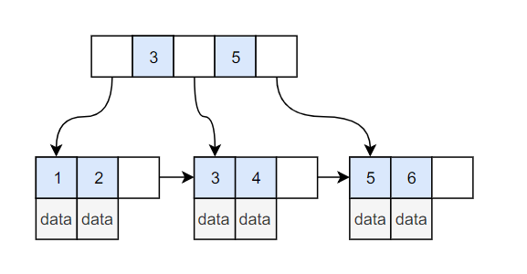

# 树

- [树概念](#树概念)
  - [双亲表示法](#双亲表示法)
  - [孩子表示法](#孩子表示法)
  - [孩子兄弟表示法](#孩子兄弟表示法)
- [二叉树](#二叉树)
  - [顺序存储结构](#顺序存储结构)
  - [二叉链表](#二叉链表)
  - [前中后续遍历](#前中后续遍历)
  - [递归与非递归写法](#递归与非递归写法)
  - [层序遍历算法](#层序遍历算法)
  - [线索二叉树](#线索二叉树)
- [树森林二叉树](#树森林二叉树)
- [哈夫曼树](#哈夫曼树)
- [B/B+树](#B/B+树)
- [红黑树](#红黑树)

---

## 树概念

- n个节点的有限集，n为0时为空树，节点可以分成m个互不相交的有限集，每个也是树
- 根节点是唯一的
- 子树个数没有限制，但是子树一定不相交
- 度：节点拥有子树的个数，叫节点的度
- 度为0的节点是叶子节点
- 树的度 是节点度的最大值
- 树的高度、深度：树中节点的最大层次，根为第一层
- 左右有次序的为有序树，否则为无序树
- 森林：m棵互不相交的树的集合

### 双亲表示法

- 树的结点不一定有孩子，但一定有双亲
- 在每个结点中设一个指示双亲结点的指示器，指向双亲结点在数组中的位置

```c++
#define Max_Tree_Size 100
typedef struct PTNode{
    int data;
    int parent;
} PTNode;

typedef struct {
    PTNode nodes[Max_Tree_Szie]; //结点数组
    int r,n; //根的位置和结点数
} PTree;
```

- parent为-1表示为根节点
- 查找双亲结点的复杂度是O(1)
- 查找结点的孩子结点需要遍历
- 可以灵活调整数据结构，增加长子、右兄弟等

### 孩子表示法

#### 方案1

- 每个结点有多个指针域
- 每个结点的指针域的个数相等，为树的度
- 指针域指向孩子结点
- 缺点：浪费空间

#### 方案2

- 每个结点有多个指针域
- 每个结点的指针域的个数不相等，最大为树的度，专门取一个位置存放指针域的个数
- 指针域指向孩子结点
- 缺点：维护困难

#### 方案3:孩子表示法

- 每个结点用顺序存储
- 结点后使用单链表存储每个结点的孩子结点

```c++
#define Max_Tree_Size 100
typedef struct CTNode{
    int child;
    struct CTNode *next;
} *ChildPtr;//单链表，初始化成指针
typedef struct{
    int data;
    ChildPtr firstchild;
} CTBox;
typedef struct{
    CTBox nodes[Max_Tree_Size];//结点数组
    int r,n;
} CTree;
```

- 可以结合双亲表示法，变成孩子双亲表示法

### 孩子兄弟表示法

- 任意一棵树，第一个孩子结点存在，则是唯一的
- 右兄弟存在，也是唯一的
- 设置两个指针分别指向第一个孩子和右兄弟
- 优点：可以把一个复杂的树变成二叉树

```c++
typedef struct CSNode{
    int data;
    struct CSNode *firstchild,*rightsib;
} CSNode,*CSTree;
```

## 二叉树

- 二叉树是有限结点的集合，也可以为空，为空二叉树
- 每个结点最多有两个子树
- 左右结点有顺序，即使只有一个子树
- 斜树：左斜树，右斜树，只有左子树或者右子树的树
- 满二叉树：所有结点都有左右子树，所有叶子都在同一层
- 完全二叉树：是只缺少最后一层的右边部分的满二叉树，也可以不缺
- 完全二叉树性质：叶子结点只出现在最后两层；最后一层左部叶子结点一定连续；如果结点的度为1则该结点一定只有左孩子

### 二叉树性质

- 二叉树的第i层最多有2的i-1次幂个结点
- 深度为k，层数为k的二叉树最多有2的k次幂-1个结点
- 终端结点数 = 度为2结点数 + 1
- 由1，满二叉树的结点数 = 2^k - 1，所以满二叉树的深度k = log2(n + 1)， 所以完全二叉树的深度 = 向下去整(log2n) + 1
- 完全二叉树中，i=1的为根节点；2i=n的只有左孩子，层序向后(2i>n)没有左孩子
- 完全二叉树中，2i+1>n的结点没有有孩子，其余结点的右孩子为2i+1
- 前序+中序  后序+中序可以还原二叉树

### 顺序存储结构

- 直接定义2^k - 1个空间，按照完全二叉树存储，空的位置填充^

### 二叉链表

- 直接在结点定义左右孩子

```c++
typedef struct BiNode{
    int data;
    struct BiNode *lchild, *rclild;
}BiNode, *BiTree;
```

### 前序遍历

- 二叉树为空，则返回空，否则先访问根节点
- 再用这个方式访问左子树，再访问右子树

```c++
void PreOrderTraverse(BiTree T){
    if(T==NULL){
        return;
    }
    printf("%c",T->data);
    PreOrderTraverse(T->lchild);
    PreOrderTraverse(T->rchild);
}
```

### 中序遍历

- 树为空，则返回
- 从根节点开始，而不访问，中序遍历左子树，然后访问根节点，再中序遍历右子树

```c++
void InOrderTraverse(BiTree T){
    if(T==NULL){
        return;
    }
    InOrderTraverse(T->lchild);
    printf("%c",T->data);
    InOrderTraverse(T->rchild);
}
```

### 后序遍历

- 从左到右先叶子结点，后根结点的方式

```c++
void PostOrderTraverse(BiTree T){
    if(T==NULL){
        return;
    }
    PostOrderTraverse(T->lchild);
    PostOrderTraverse(T->rchild);
    printf("%c",T->data);
}
```

### 层序遍历算法

- 从树的第一层开始访问，从上而下，从左到右访问

### 建立二叉树

- 拓展二叉树：给每个结点加上虚拟的左右子树
- 将拓展后的二叉树的前序遍历结果作为输入

```c++
void CreateBiTree(BiTree *T){
    char ch;
    scanf("%c",&ch);
    if(ch == '#'){
        *T=NULL;
    }
    else{
        *T = (BiTree)malloc(sizeof(BiNode));
        if(!*T){
            exit(OVERFLOW);
        }
        (*T)->data = ch;
        CreateBiTree(&(*T)->lchild);
        CreateBiTree(&(*T)->rchild);
    }
}
```

### 线索二叉树

- 利用二茬链表的空结点
- 指向前驱和后继的指针叫做线索，加上线索的二叉树为线索二叉树
- 将所有空指针中的rchild改成指向该结点的后继结点，没有后继指向NULL
- 将所有空指针中的lchild改成指向该结点的前驱结点，没有前驱指向NULL
- 此时不能判断rchild和lchild指向的是孩子还是后继或者前驱
- 需要加上rtag和ltag来区分
- 为0时指向孩子，为1时指向后继或者前驱

```c++
typedef struct BiThrNode{
    int data;
    struct BiThrNode *lchild,*rchild;
    int ltag;
    int rtag;
}BiThrNode, *BiThrTree;
```

中序遍历线索化

```c++
BiThrTree pre;//全局变量，始终指向刚刚访问过的结点

void InTreading(BiThrTree p){
    if(p){
        InTreading(p->lchild);

        if(!p->lchild){//没有左孩子
            p->ltag = 1;
            p->lchild = pre;
        }

        //因为p的后继结点还有没访问到，所以只能考虑pre的右孩子指针
        //如果为空，说明p就是pre的后继
        if(!pre->rchild){//前驱没有右孩子
            pre->rtag = 1;
            pre->rchild = p;
        }
        pre = p;

        InTreading(p->rchild);
    }
}
```

## 树森林二叉树

### 树转二叉树

- 在所有兄弟结点之间加一条线
- 对于每个结点，只保留与第一个孩子的连线，删除其他与孩子结点的连线
- 旋转树调整角度，对于每个结点，第一个孩子是左孩子，第一个孩子的兄弟为右孩子

### 森林转二叉树

- 将每个树转成二叉树
- 第一个二叉树不懂，下一个二叉树的根接到第一个二叉树的根节点的右孩子上，直到所有二叉树

### 二叉树转树

- 如果结点有左孩子，则将该结点与该结点的左孩子的所有右孩子相连
- 删除所有结点与其右孩子的连线

### 二叉树转森林

- 递归断开根结点的所有右孩子
- 将分离后的二叉树转成树

## 哈夫曼树

- 路径：从树的一个结点到另一个结点之间的分支，分支数目为路径长度
- 树的路径长度，根到每一结点的路径长度的和
- 赫夫曼树：带权路径长度(WPL)最小的二叉树
- WPL = 每个结点求和（结点的权*结点到根的路径长度）

### 构建哈夫曼树

- 将结点按权值从小到大排列
- 取两个最小的，小的在左，大的在右，新一个结点为根，生成一个新二叉树，新结点的权为两个孩子权的和
- 把新结点从新放回排列中，还是从小到大

### 哈夫曼编码

- 假设需要编码的字符集为{d1,d2,d3,...,dn}，各个字符的出现次数的集合为{w1,w2,w3,...,wn}
- 以d为结点，w为权重构造赫夫曼树
- 规定左分支为0，右分支为1
- 根结点到叶子节点经过的路径组成的0和1序列便为该叶子结点对应字符的赫夫曼编码

## B/B+树

### 1. 数据结构

B Tree 指的是 Balance Tree，也就是平衡树。平衡树是一颗查找树，并且所有叶子节点位于同一层。

B+ Tree 是基于 B Tree 和叶子节点顺序访问指针进行实现，它具有 B Tree 的平衡性，并且通过顺序访问指针来提高区间查询的性能。

在 B+ Tree 中，一个节点中的 key 从左到右非递减排列，如果某个指针的左右相邻 key 分别是 key<sub>i</sub> 和 key<sub>i+1</sub>，且不为 null，则该指针指向节点的所有 key 大于等于 key<sub>i</sub> 且小于等于 key<sub>i+1</sub>。

<div align="center">  </div><br>

### 2. 操作

进行查找操作时，首先在根节点进行二分查找，找到一个 key 所在的指针，然后递归地在指针所指向的节点进行查找。直到查找到叶子节点，然后在叶子节点上进行二分查找，找出 key 所对应的 data。

插入删除操作会破坏平衡树的平衡性，因此在插入删除操作之后，需要对树进行一个分裂、合并、旋转等操作来维护平衡性。

## B+树

- B+ 树通常用于数据库和操作系统的文件系统中。NTFS, ReiserFS, NSS, XFS, JFS, ReFS 和BFS等文件系统都在使用B+树作为元数据索引。
- B+ 树的特点是能够保持数据稳定有序，其插入与修改拥有较稳定的对数时间复杂度。B+ 树元素自底向上插入。

## B树和B+树的区别

- B-树：多路搜索树，每个结点存储M/2到M个关键字，非叶子结点存储指向关键字范围的子结点；
- B-树：所有关键字在整颗树中出现，且只出现一次，非叶子结点可以命中；

- B+树：在B-树基础上，为叶子结点增加链表指针，所有关键字都在叶子结点中出现，非叶子结点作为叶子结点的索引；B+树总是到叶子结点才命中；

## @红黑树定义

红黑树，一种二叉查找树，但在每个结点上增加一个存储位表示结点的颜色，可以是Red或Black。通过对任何一条从根到叶子的路径上各个结点着色方式的限制，红黑树确保没有一条路径会比其他路径长出俩倍，因而是接近平衡的。

红黑树的节点定义如下：

```C++
enum Color {
    RED = 0,
    BLACK = 1
};
struct RBTreeNode {
    struct RBTreeNode*left, *right, *parent;
    int key;
    int data;
    Color color;
};
```

## @红黑树特点

- 节点是红色或黑色。
- 根是黑色。
- 所有叶子都是黑色（叶子是NIL节点）。
- 每个红色节点的两个子节点都是黑色。(从每个叶子到根的所有路径上不能有两个连续的红色节点)
- 从任一节点到其每个叶子的所有简单路径 都包含相同数目的黑色节点。
- 插入删除不需要数据复制。
- 操作复杂度仅跟树高有关。
- RBTree本身也是二叉排序树的一种，key值有序，且唯一。
- 必须保证key可排序。

基于红黑树实现的map结构（实际上是map, set, multimap，multiset底层均是红黑树），不仅增删数据时不需要移动数据，其所有操作都可以在O(logn)时间范围内完成。另外，基于红黑树的map在通过迭代器遍历时，得到的是key按序排列后的结果，这点特性在很多操作中非常方便。

1. 它是二叉排序树（继承二叉排序树特显）：
    - 若左子树不空，则左子树上所有结点的值均小于或等于它的根结点的值。

    - 若右子树不空，则右子树上所有结点的值均大于或等于它的根结点的值。

    - 左、右子树也分别为二叉排序树。

2. 它满足如下几点要求：
    - 树中所有节点非红即黑。

    - 根节点必为黑节点。

    - 红节点的子节点必为黑（黑节点子节点可为黑）。

    - 从根到NULL的任何路径上黑结点数相同。

3. 查找时间一定可以控制在O(logn)。

所以对红黑树的操作需要满足两点：1.满足二叉排序树的要求；2.满足红黑树自身要求。通常在找到节点通过和根节点比较找到插入位置之后，还需要结合红黑树自身限制条件对子树进行左旋和右旋。

相比于AVL树，红黑树平衡性要稍微差一些，不过创建红黑树时所需的旋转操作也会少很多。相比于最简单的BST，BST最差情况下查找的时间复杂度会上升至O(n)，而红黑树最坏情况下查找效率依旧是O(logn)。所以说红黑树之所以能够在STL及Linux内核中被广泛应用就是因为其折中了两种方案，既减少了树高，又减少了建树时旋转的次数。

从红黑树的定义来看，红黑树从根到NULL的每条路径拥有相同的黑节点数（假设为n），所以最短的路径长度为n（全为黑节点情况）。因为红节点不能连续出现，所以路径最长的情况就是插入最多的红色节点，在黑节点数一致的情况下，最可观的情况就是黑红黑红排列......最长路径不会大于2n，这里路径长就是树高。

### 红黑树插入的几种情况

情况1，z的叔叔y是红色的。 情况2：z的叔叔y是黑色的，且z是右孩子 情况3：z的叔叔y是黑色的，且z是左孩子

### 红黑树删除的几种情况

III、红黑树删除的几种情况。 情况1：x的兄弟w是红色的。 情况2：x的兄弟w是黑色的，且w的俩个孩子都是黑色的。 情况3：x的兄弟w是黑色的，且w的左孩子是红色，w的右孩子是黑色。 情况4：x的兄弟w是黑色的，且w的右孩子是红色的。

## @红黑树和AVL树的比较：

红黑树：

    (1)并不追求“完全平衡”——它只要求部分地达到平衡要求，降低了对旋转的要求，从而提高了性能。红黑树能够以O(log2 n) 的时间复杂度进行搜索、插入、删除操作。
    (2)此外，由于它的设计，任何不平衡都会在三次旋转之内解决。红黑树能够给我们一个比较“便宜”的解决方案。红黑树的算法时间复杂度和AVL相同，但统计性能比AVL树更高。

AVL树：

    它的左子树和右子树都是AVL树，左子树和右子树的高度差不能超过;
    查找、插入和删除在平均和最坏情况下都是O(log n),增加和删除可能需要通过一次或多次树旋转来重新平衡这个树;
    一棵n个结点的AVL树的其高度保持在0(log2(n)),不会超过3/2log2(n+1) 一棵n个结点的AVL树的平均搜索长度保持在0(log2(n)). 一棵n个结点的AVL树删除一个结点做平衡化旋转所需要的时间为0(log2(n)).
